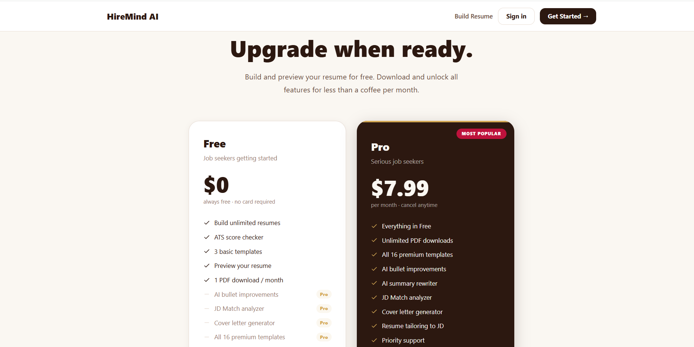

# HireMind AI — AI-Powered Career Intelligence Platform

> Build, optimize, and tailor your resume with AI. Land more interviews.

## 🌐 Live Demo

**[https://hiremind-ai-kohl.vercel.app](https://hiremind-ai-kohl.vercel.app)**

| Service | URL |
|---------|-----|
| Frontend (Vercel) | https://hiremind-ai-kohl.vercel.app |
| Backend API (Render) | https://hiremind-backend-ekq8.onrender.com |

> ⚠️ The backend runs on Render's free tier — first request after inactivity may take 30-60 seconds to wake up.

## 📸 Screenshots

### Home Page


### Resume Builder Wizard


### ATS Checker


### JD Match Analyzer


### Cover Letter Generator


### Pricing Page


> To add screenshots: take a screenshot of each page, save them in a `screenshots/` folder in the repo root, and push.

---

## ✨ Features

### 📄 Resume Builder
- Upload existing PDF or DOCX resume
- AI automatically extracts all data using **Gemini 1.5 Flash** (primary) + **Groq Llama 3.3** (fallback)
- Handles every resume format: single-column, two-column, sidebar, table-based, image-heavy
- Step-by-step wizard: Heading → Education → Experience → Skills → Summary → Projects → Certifications → Finalize
- Live preview updates as you edit
- **16+ professional resume templates** across Tech, Professional, Modern, Minimal, Executive categories
- Download as **PDF** or **DOCX**
- AI bullet point improvement (per-bullet ✨ button)
- AI "Rewrite All Bullets" per job card
- AI summary rewriter
- AI Resume Review panel with score, strengths, improvements, and ATS tips

### 🛡️ ATS Checker
- Upload resume and get an instant **ATS compatibility score**
- **5-category scoring breakdown**: Content (30%), Format (20%), Style (20%), Sections (20%), Skills (10%)
- Accurate scoring based on structured resume data — not just raw text
- Missing keywords detection with one-click copy chips
- Specific improvement recommendations
- **AI Auto-Fix** that rewrites weak bullets, adds missing keywords, and improves the summary
- Before/After score comparison modal with full change log
- "Review in Builder" to continue editing the fixed resume

### 🔍 JD Match Analyzer
- Upload resume + paste any job description
- Overall **match score percentage** with section-by-section breakdown
- Matched vs. missing skills with visual progress bars
- Recruiter assessment with strengths, concerns, and recommendation
- **One-click resume optimization** tailored to the specific job
- AI-powered rewriting with JD keywords added naturally
- Downloads optimized resume as a clean ATS PDF

### ✉️ Cover Letter Generator
- AI generates personalized cover letters from your resume + job description
- **10 professional templates**: Modern Minimal, Executive Clean, Creative, FAANG, and more
- Edit the generated text directly in the browser
- Download as **PDF** or **DOCX**, or copy as plain text
- Generates 3-paragraph structure: opening, experience highlight, closing

### 🎨 Resume Templates Gallery
- Browse **16+ premium templates** with live previews
- Filter by category (Tech, Professional, Modern, Minimal, Bold, Creative, Executive)
- ATS score badge on each template
- Full-page preview modal before selecting
- "Use Template" navigates directly to the builder with your data pre-loaded

### 💰 Pricing
- **Free** plan: unlimited builds, ATS checker, 1 PDF/month, 3 basic templates
- **Pro** plan ($7.99/month): unlimited downloads, all 16 templates, all AI features, JD matching, cover letter generator
- 30-day free Pro trial

---

## 🛠️ Tech Stack

### Frontend
| Technology | Purpose |
|-----------|---------|
| React 18 | UI framework |
| Vite | Build tool & dev server |
| Tailwind CSS | Styling |
| React Router v6 | Client-side routing |
| html2pdf.js | PDF export |
| Axios | HTTP client |

### Backend
| Technology | Purpose |
|-----------|---------|
| FastAPI (Python) | REST API framework |
| SQLAlchemy 2.0 | ORM |
| SQLite (dev) / PostgreSQL (prod) | Database |
| pdfplumber | PDF text extraction |
| Uvicorn | ASGI server |

### AI / APIs
| Service | Usage |
|---------|-------|
| **Gemini 1.5 Flash** | Primary PDF extraction — reads PDFs natively (vision), handles any layout |
| **Groq (Llama 3.3-70b)** | Bullet improvement, summary rewriting, AI review, ATS fix, JD optimization |
| **pdfplumber** | Fallback text extraction with multi-column detection |

### Security & Auth
- JWT access tokens (configurable expiry)
- BCrypt password hashing
- Per-IP rate limiting on all AI endpoints (in-memory sliding window)

---

## 🚀 Getting Started

### Prerequisites
- Node.js 18+
- Python 3.10+
- **Groq API key** — free at [console.groq.com](https://console.groq.com)
- **Gemini API key** — free at [aistudio.google.com](https://aistudio.google.com)

### 1. Clone the repository
```bash
git clone https://github.com/yourusername/hiremind-ai
cd hiremind-ai
```

### 2. Backend setup
```bash
cd backend
python -m venv .venv

# Windows
.venv\Scripts\activate

# macOS/Linux
source .venv/bin/activate

pip install -r requirements.txt
```

### 3. Create `backend/.env`
```env
DATABASE_URL=sqlite:///./hiremind_local.db
GROQ_API_KEY=gsk_your_groq_key_here
GEMINI_API_KEY=your_gemini_key_here
OPENAI_API_KEY=sk-optional-openai-key
OPENAI_MODEL=gpt-4o-mini
JWT_SECRET_KEY=change-me-in-production
ENVIRONMENT=local
BACKEND_CORS_ORIGINS=["http://localhost:5173","http://127.0.0.1:5173"]
```

### 4. Start the backend
```bash
# IMPORTANT: must use .venv Python (has groq, pdfplumber installed)
.venv\Scripts\uvicorn app.main:app --reload --port 8011
```

### 5. Frontend setup
```bash
cd frontend
npm install
```

### 6. Create `frontend/.env`
```env
VITE_API_BASE_URL=http://127.0.0.1:8011/api/v1
```

### 7. Start the frontend
```bash
npm run dev
```

### 8. Open [http://127.0.0.1:5173](http://127.0.0.1:5173)

---

## 📁 Project Structure

```
hiremind-ai/
├── frontend/
│   ├── src/
│   │   ├── pages/
│   │   │   ├── Home.jsx                  Landing page
│   │   │   ├── Pricing.jsx               Pricing page
│   │   │   ├── ResumeExpert.jsx          Resume build wizard
│   │   │   ├── ResumeBuilder.jsx         Live resume editor
│   │   │   ├── ResumeAnalysis.jsx        ATS Checker
│   │   │   ├── ResumeTemplates.jsx       Template gallery
│   │   │   ├── JobMatch.jsx              JD Match Analyzer
│   │   │   └── CoverLetterExpert.jsx     Cover letter builder
│   │   ├── components/
│   │   │   ├── ResumeTemplateRenderer.jsx  16 template renderers
│   │   │   ├── CoverLetterTemplateEngine.jsx
│   │   │   ├── SignupModal.jsx
│   │   │   └── UpgradeModal.jsx
│   │   ├── layouts/
│   │   │   ├── AppLayout.jsx             Main nav + routing shell
│   │   │   └── AuthLayout.jsx
│   │   ├── services/
│   │   │   ├── api.js                    Axios instance
│   │   │   ├── resumeService.js          Resume upload/fetch
│   │   │   └── aiService.js              All AI API calls
│   │   └── utils/
│   │       ├── resumeExtraction.js       Schema mapping & validation
│   │       ├── resumeTemplateExport.js   HTML template renderer (15 templates)
│   │       ├── pdfExport.js              html2pdf download helpers
│   │       └── exportDocument.js         Print/backend PDF export
└── backend/
    ├── app/
    │   ├── ai/
    │   │   ├── openai_client.py          Gemini + Groq extraction
    │   │   └── prompts.py                AI prompt templates
    │   ├── api/routes/
    │   │   ├── resume.py                 All resume endpoints + rate limiting
    │   │   ├── analysis.py               Analysis endpoints
    │   │   └── auth.py                   Auth endpoints
    │   ├── services/
    │   │   ├── resume_service.py         Upload handler + field mapping
    │   │   ├── resume_parser.py          DOCX parser
    │   │   └── ai_service.py             Groq AI functions
    │   └── core/
    │       └── config.py                 Settings & env vars
    └── requirements.txt
```

---

## 🔌 API Endpoints

### Resume
| Method | Endpoint | Description | Rate Limit |
|--------|----------|-------------|-----------|
| POST | `/api/v1/resume/extract` | Upload + AI-parse resume | 5/hr |
| POST | `/api/v1/resume/improve-summary` | Rewrite professional summary | 10/hr |
| POST | `/api/v1/resume/improve-bullet` | Improve single bullet point | — |
| POST | `/api/v1/resume/rewrite-bullets` | Rewrite all bullets for a job | — |
| POST | `/api/v1/resume/ai-review` | Full resume review with score | 5/hr |
| POST | `/api/v1/resume/auto-fix-ats` | Auto-fix resume for ATS | 5/hr |
| POST | `/api/v1/resume/optimize-for-job` | Tailor resume to a JD | 5/hr |
| POST | `/api/v1/resume/parse-ai` | Precision AI parse of text | — |
| POST | `/api/v1/resume/rewrite` | Full ATS rewrite | — |

### Analysis
| Method | Endpoint | Description |
|--------|----------|-------------|
| POST | `/api/v1/analysis/resume/{id}` | Analyze uploaded resume |
| POST | `/api/v1/analysis/job-match` | JD match scoring |
| POST | `/api/v1/analysis/roadmap` | Career roadmap generation |

### Auth
| Method | Endpoint | Description |
|--------|----------|-------------|
| POST | `/api/v1/auth/register` | Create account |
| POST | `/api/v1/auth/login` | Get JWT token |
| GET  | `/api/v1/auth/me` | Current user |

---

## 🎯 Key Implementation Details

### Resume Extraction Pipeline
1. User uploads PDF
2. **Gemini 1.5 Flash** receives the PDF directly (as binary, no text extraction needed) — works for ALL formats including image-based
3. If Gemini is unavailable, **pdfplumber** extracts text using 4 strategies (standard, char-level, column-split at 30/38/46/54%) and sends to **Groq Llama 3.3**
4. Regex fallbacks recover email, phone, LinkedIn, GitHub if AI missed them
5. Service layer maps camelCase AI response → snake_case Python schema
6. Fields populate the 8-step wizard automatically

### ATS Scoring Algorithm
```
Overall Score = Content×30% + Format×20% + Style×20% + Sections×20% + Skills×10%

Content  = summary present + 2+ jobs + bullet quality + metrics + projects
Format   = standard layout + section presence
Style    = action verb ratio + no first-person pronouns
Sections = summary + experience + education + skills all present
Skills   = 6+ skills + 12+ skills + categorized + coverage
```

### Resume Extraction — Multi-Strategy Text Extraction
For complex PDFs (two-column, sidebar, table layouts), pdfplumber alone fails because it reads left-to-right across all columns. The fallback uses:
- **Strategy A**: Standard `extract_text()` (single-column resumes)
- **Strategy B**: Character-level position sort (handles any layout)
- **Strategies C1–C4**: Column splits at 30%, 38%, 46%, 54% (sidebar + two-column resumes)
Best result picked by word count; regex fallbacks always applied for contact fields.

---

## 🚀 Deployment

### Frontend — Vercel
```
Root Directory:  frontend
Build Command:   npm run build
Output Dir:      dist
Environment:     VITE_API_BASE_URL=https://your-backend.onrender.com/api/v1
```

### Backend — Render
```
Root Directory:  backend
Build Command:   pip install -r requirements.txt
Start Command:   uvicorn app.main:app --host 0.0.0.0 --port $PORT
Environment:     GROQ_API_KEY, GEMINI_API_KEY, JWT_SECRET_KEY, DATABASE_URL, ...
```

---

## 👩‍💻 Author

**Sahithi Devineni**
- LinkedIn: [linkedin.com/in/sahithi-devineni](https://linkedin.com/in/sahithi-devineni)
- Email: sahithidevineni7@gmail.com

---

## 📄 License

MIT License — free to use, modify, and distribute.
